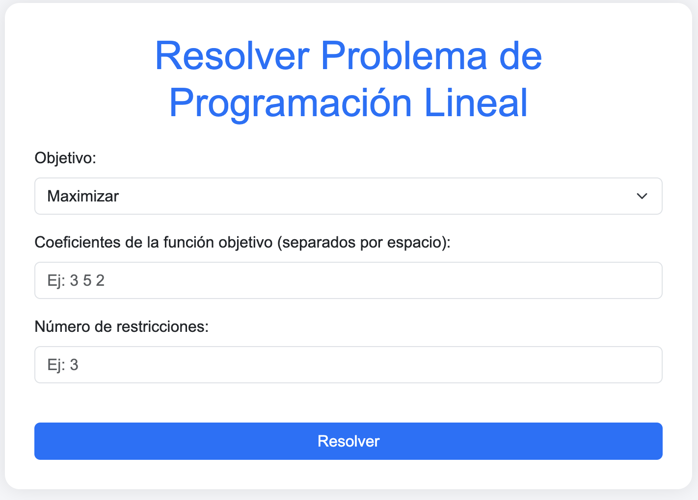

🧮 Programación Lineal Web App
Una aplicación web interactiva desarrollada con Python + Flask que permite resolver y visualizar gráficamente modelos de programación lineal (PL) con dos variables. Ideal para estudiantes, docentes o cualquier persona interesada en optimización lineal.

🚀 Funcionalidades
Ingreso dinámico de función objetivo y restricciones.

Resolución automática usando PuLP.

Visualización de la región factible, restricciones y punto óptimo con Plotly.

Soporte para maximización y minimización.

📷 Vista previa

🛠 Tecnologías utilizadas
Flask

PuLP

Plotly

Shapely

Gunicorn

📦 Instalación local
Clona el repositorio:

bash
Copiar
Editar
git clone https://github.com/AlexCoilaJrt/ProgramacionLienalM.git
cd ProgramacionLienalM
Crea un entorno virtual (opcional pero recomendado):

bash
Copiar
Editar
python -m venv venv
source venv/bin/activate  # En Windows: venv\Scripts\activate
Instala las dependencias:

bash
Copiar
Editar
pip install -r requirements.txt
Ejecuta la aplicación:

bash
Copiar
Editar
python app.py
Abre tu navegador y entra a http://localhost:5000

🌐 Despliegue en línea
La app está desplegada en Render:

🔗 https://programacionlienalm-1.onrender.com

🧠 Cómo funciona
El usuario llena un formulario con:

Tipo de optimización (max o min)

Coeficientes de la función objetivo

Número y detalle de las restricciones

Se resuelve el modelo con PuLP.

Si hay solo dos variables, se genera una gráfica:

Región factible

Líneas de restricción

Punto óptimo

📄 Licencia
MIT © AlexCoilaJrt
